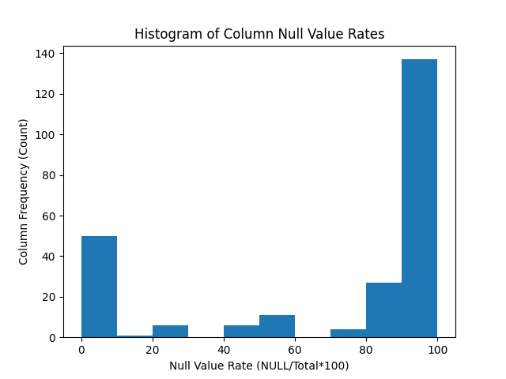
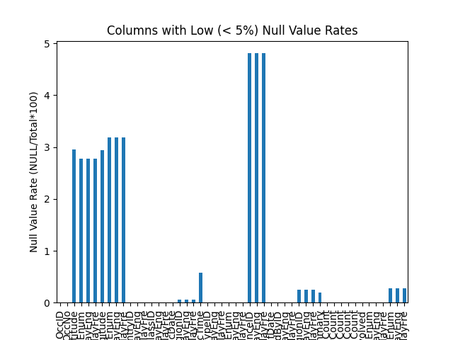
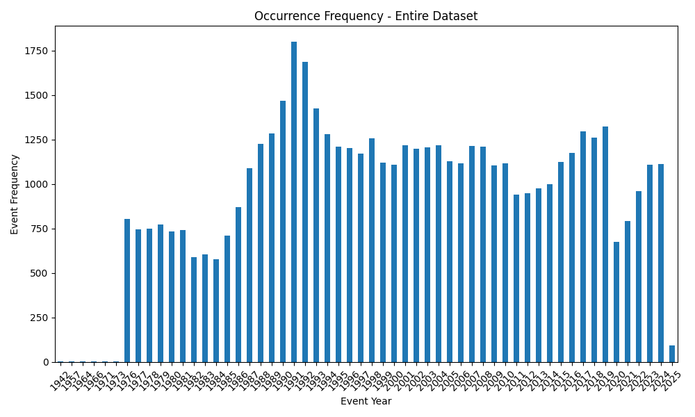
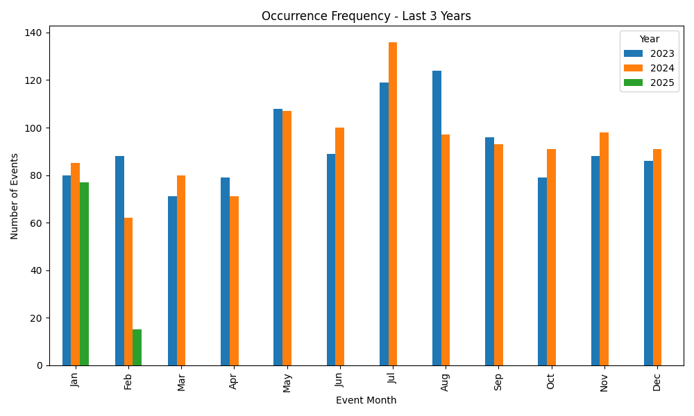

# Report

## 1. Completeness of Occurrence Table
### Prompt
Understanding data quality is essential in data science, and data quality encompasses a variety of dimensions.
Examine the Occurrence table and evaluate the completeness of the dataset. Use these findings to provide
recommendations about what types of analysis could be conducted with this data to better understand aviation accidents
and safety incidents as reported in the ASIS data.

### Response
The thoroughness of this examination would likely depend on the use case of the data (i.e. are we doing a quick check 
before an initial exploration of the data, am I doing an investigation to create a data cleaning plan before using 
the table in more expensive modeling workflows, or joining with other large datasets, etc.), but below are some initial 
checks I performed as a starting off point. 

#### 1. Null Values
It looks like about 70% of the dataset is empty (8,963,777 of 12,763,564 cells). A number of columns appear to be empty 
(or near empty) of datapoints. I wasn't sure if this was due to it being a public version of the data. As a quick sanity 
check, I validated the number of columns reported in this table equals the column count of the data (242 features).

_note: ranges are left-inclusive, right-exclusive_

| Ratio Null/Total | Column Count | Column Names                                                                                                                                                                                                                                                                                                                                                                                                                                                                                                                                                                                                                                                                                                                                                                                                                                                                                                                                                                                                                                                                                                                                                                                                                                                                                                                                                                                                                                                                                                                                                                                                                                                                                                                                                                                                                                                                                                                                                                                                                                                                                                                                                                                                                                                                                                                                                                                                                                                                                                                                                                                                                                                                                                                                                                                                                                                                                                                                                                                                                                                                                                                                                                                                                                                                                                                                                                        |                                                                                                                                                                                                                                                                                                                                                                                                                                                                                                                                                                                                                                                                                                                                                                                                                                                                                                                                                                                                                                                                                                                                                                                                                                                                                                                                                                                                                                                                                                                                                                                                                                                                                                                                                                                                                                                                                                                                                                                                                                                                                                                                                                                                                                                                                                                                                                                                                                                                                                                                                                                                                                                                                                                                                                                                                                                                                                                                                                                                                                                                                                                                                                                                                                                                                                                                                                
|------------------|--------------|-------------------------------------------------------------------------------------------------------------------------------------------------------------------------------------------------------------------------------------------------------------------------------------------------------------------------------------------------------------------------------------------------------------------------------------------------------------------------------------------------------------------------------------------------------------------------------------------------------------------------------------------------------------------------------------------------------------------------------------------------------------------------------------------------------------------------------------------------------------------------------------------------------------------------------------------------------------------------------------------------------------------------------------------------------------------------------------------------------------------------------------------------------------------------------------------------------------------------------------------------------------------------------------------------------------------------------------------------------------------------------------------------------------------------------------------------------------------------------------------------------------------------------------------------------------------------------------------------------------------------------------------------------------------------------------------------------------------------------------------------------------------------------------------------------------------------------------------------------------------------------------------------------------------------------------------------------------------------------------------------------------------------------------------------------------------------------------------------------------------------------------------------------------------------------------------------------------------------------------------------------------------------------------------------------------------------------------------------------------------------------------------------------------------------------------------------------------------------------------------------------------------------------------------------------------------------------------------------------------------------------------------------------------------------------------------------------------------------------------------------------------------------------------------------------------------------------------------------------------------------------------------------------------------------------------------------------------------------------------------------------------------------------------------------------------------------------------------------------------------------------------------------------------------------------------------------------------------------------------------------------------------------------------------------------------------------------------------------------------------------------------|
| 100%             | 9            | 'SafetyCommIssuedEnum_DisplayEng', 'SafetyCommIssuedEnum_DisplayFre', 'AirportDescription', 'InitialPositionEnum', 'InitialPositionEnum_DisplayEng', 'InitialPositionEnum_DisplayFre', 'FinalPositionEnum', 'FinalPositionEnum_DisplayEng', 'FinalPositionEnum_DisplayFre'                                                                                                                                                                                                                                                                                                                                                                                                                                                                                                                                                                                                                                                                                                                                                                                                                                                                                                                                                                                                                                                                                                                                                                                                                                                                                                                                                                                                                                                                                                                                                                                                                                                                                                                                                                                                                                                                                                                                                                                                                                                                                                                                                                                                                                                                                                                                                                                                                                                                                                                                                                                                                                                                                                                                                                                                                                                                                                                                                                                                                                                                                                          |
| 90-100%          | 128          | 'BearingID', 'BearingID_Abbr', 'BearingID_CompassPoint', 'BearingID_Highest', 'BearingID_Lowest', 'BearingID_Middle', 'Distance', 'DistanceEnum', 'DistanceEnumEng', 'DistanceEnumFre', 'OceanID', 'OceanID_DisplayEng', 'OceanID_DisplayFre', 'SkyCondID', 'SkyCondID_DisplayEng', 'SkyCondID_DisplayFre', 'InflightIcingCondEnum', 'InflightIcingCondEnum_DisplayEng', 'InflightIcingCondEnum_DisplayFre', 'GeneralWeatherID', 'GeneralWeatherID_DisplayEng', 'GeneralWeatherID_DisplayFre', 'Temperature', 'TemperatureEnum', 'TemperatureEnum_DisplayEng', 'TemperatureEnum_DisplayFre', 'SwDirection', 'SwVariableDirIND', 'SwVariableDirIND_DisplayEng', 'SwVariableDirIND_DisplayFre', 'SwSpeed', 'SwPeakGus', 'SwCrosswind', 'SwCrosswindEnum', 'SwCrosswindEnum_DisplayEng', 'SwCrosswindEnum_DisplayFre', 'SwTallWind', 'VisibilyCeiling', 'Visibility', 'RVRUnlimitedIND', 'RVRUnlimitedIND_DisplayEng', 'RVRUnlimitedIND_DisplayFre', 'RVRA', 'RVRB', 'WeatherPhenomenaTypeID', 'WeatherPhenomenaTypeID_DisplayEng', 'WeatherPhenomenaTypeID_DisplayFre', 'WeatherPhenomenaDescID', 'WeatherPhenomenaDescID_DisplayEng', 'WeatherPhenomenaDescID_DisplayFre', 'WeatherPhenomenaIntensityID', 'WeatherPhenomenaIntensityID_DisplayEng', 'WeatherPhenomenaIntensityID_DisplayFre', 'LandingTakeOffAirportID', 'LandingTakeOffAirportID_AirportName', 'AarfCategoryID', 'AarfCategoryID_DisplayEng', 'AarfCategoryID_DisplayFre', 'ControlStatusID', 'ControlStatusID_DisplayEng', 'ControlStatusID_DisplayFre', 'ApproachTypeID', 'ApproachTypeID_DisplayEng', 'ApproachTypeID_DisplayFre', 'ApproachRunwayID', 'ApproachRunwayID_DisplayEng', 'ApproachRunwayID_DisplayFre', 'RunwayID', 'RunwayID_DisplayEng', 'RunwayID_DisplayFre', 'TaxiwayID', 'TaxiwayID_DisplayEng', 'TaxiwayID_DisplayFre', 'PadID', 'PadID_DisplayEng', 'PadID_DisplayFre', 'HelicopterTakeOffLandingSiteID', 'HelicopterTakeOffLandingSiteID_DisplayEng', 'HelicopterTakeOffLandingSiteID_DisplayFre', 'RunwaySurfaceTypeID', 'RunwaySurfaceTypeID_DisplayEng', 'RunwaySurfaceTypeID_DisplayFre', 'RunwaySurfaceID', 'RunwaySurfaceID_DisplayEng', 'RunwaySurfaceID_DisplayFre', 'RunwaySlopeID', 'RunwaySlopeID_DisplayEng', 'RunwaySlopeID_DisplayFre', 'ResaSurfaceTypeID', 'ResaSurfaceTypeID_DisplayEng', 'ResaSurfaceTypeID_DisplayFre', 'WaveHeightID', 'WaveHeightID_DisplayEng', 'WaveHeightID_DisplayFre', 'WaterSurfaceConditionID', 'WaterSurfaceConditionID_DisplayEng', 'WaterSurfaceConditionID_DisplayFre', 'AreaTypeDetailID', 'AreaTypeDetailID_DisplayEng', 'AreaTypeDetailID_DisplayFre', 'ToLdgRelToSwellID', 'ToLdgRelToSwellID_DisplayEng', 'ToLdgRelToSwellID_DisplayFre', 'InitialPositionID', 'InitialPositionID_DisplayEng', 'InitialPositionID_DisplayFre', 'FinalPositionID', 'FinalPositionID_DisplayEng', 'FinalPositionID_DisplayFre', 'LandingTakeOffLocation', 'ResaLength', 'ResaWidth', 'TouchdownThreshold', 'TouchdownThresholdEnum', 'TouchdownThresholdEnum_DisplayEng', 'TouchdownThresholdEnum_DisplayFre', 'TouchdownCentreline', 'FinalThreshold', 'FinalThresholdEnum', 'FinalThresholdEnum_DisplayEng', 'FinalThresholdEnum_DisplayFre', 'FinalCentreline', 'FullProcedureIND', 'FullProcedureIND_DisplayEng', 'FullProcedureIND_DisplayFre', 'SurfaceContaminationID', 'SurfaceContaminationID_DisplayEng', 'SurfaceContaminationID_DisplayFre' |
| 80-90%           | 27           | 'LightCondID', 'LightCondID_DisplayEng', 'LightCondID_DisplayFre', 'SwDirectionEnum', 'SwDirectionEnum_DisplayEng', 'SwDirectionEnum_DisplayFre', 'TakeOffLandingTypeID', 'TakeOffLandingTypeID_DisplayEng', 'TakeOffLandingTypeID_DisplayFre', 'AerodromeOperatorID', 'AerodromeOperatorID_DisplayEng', 'AerodromeOperatorID_DisplayFre', 'ManeuverToFinalID', 'ManeuverToFinalID_DisplayEng', 'ManeuverToFinalID_DisplayFre', 'Elevation', 'OsLengthTotal', 'OsLengthAvailable', 'OsLengthUtilized', 'OsWidthTotal', 'OsWidthAvailable', 'TouchdownCentrelineEnum', 'TouchdownCentrelineEnum_DisplayEng', 'TouchdownCentrelineEnum_DisplayFre', 'FinalCentrelineEnum', 'FinalCentrelineEnum_DisplayEng', 'FinalCentrelineEnum_DisplayFre'                                                                                                                                                                                                                                                                                                                                                                                                                                                                                                                                                                                                                                                                                                                                                                                                                                                                                                                                                                                                                                                                                                                                                                                                                                                                                                                                                                                                                                                                                                                                                                                                                                                                                                                                                                                                                                                                                                                                                                                                                                                                                                                                                                                                                                                                                                                                                                                                                                                                                                                                                                                                                                         |
| 70-80%           | 4            | 'ICAOCategoryID', 'ICAO_DisplayEng', 'ICAO_DisplayFre', 'SafetyCommIssuedEnum'                                                                                                                                                                                                                                                                                                                                                                                                                                                                                                                                                                                                                                                                                                                                                                                                                                                                                                                                                                                                                                                                                                                                                                                                                                                                                                                                                                                                                                                                                                                                                                                                                                                                                                                                                                                                                                                                                                                                                                                                                                                                                                                                                                                                                                                                                                                                                                                                                                                                                                                                                                                                                                                                                                                                                                                                                                                                                                                                                                                                                                                                                                                                                                                                                                                                                                      |
| 60-70%           | 0            | _none_                                                                                                                                                                                                                                                                                                                                                                                                                                                                                                                                                                                                                                                                                                                                                                                                                                                                                                                                                                                                                                                                                                                                                                                                                                                                                                                                                                                                                                                                                                                                                                                                                                                                                                                                                                                                                                                                                                                                                                                                                                                                                                                                                                                                                                                                                                                                                                                                                                                                                                                                                                                                                                                                                                                                                                                                                                                                                                                                                                                                                                                                                                                                                                                                                                                                                                                                                                              |
| 50-60%           | 11           | 'AirportID', 'AirportID_AirportName', 'AirportID_CountryID', 'AirportID_CountryID_DisplayEng', 'AirportID_CountryID_DisplayFre', 'Airport_ProvinceID', 'AirportID_ProvinceID_DisplayEng', 'AirportID_ProvinceID_DisplayFre', 'Location', 'ICAO', 'CommonName'                                                                                                                                                                                                                                                                                                                                                                                                                                                                                                                                                                                                                                                                                                                                                                                                                                                                                                                                                                                                                                                                                                                                                                                                                                                                                                                                                                                                                                                                                                                                                                                                                                                                                                                                                                                                                                                                                                                                                                                                                                                                                                                                                                                                                                                                                                                                                                                                                                                                                                                                                                                                                                                                                                                                                                                                                                                                                                                                                                                                                                                                                                                       |
| 40-50%           | 6            | 'OccIncidentTypeID', 'OccIncidentTypeID_DisplayEng', 'OccIncidentTypeID_DisplayFre', 'SeriousIncidentEnum', 'SeriousIncidentEnum_DisplayEng', 'SeriousIncidentEnum_DisplayFre'                                                                                                                                                                                                                                                                                                                                                                                                                                                                                                                                                                                                                                                                                                                                                                                                                                                                                                                                                                                                                                                                                                                                                                                                                                                                                                                                                                                                                                                                                                                                                                                                                                                                                                                                                                                                                                                                                                                                                                                                                                                                                                                                                                                                                                                                                                                                                                                                                                                                                                                                                                                                                                                                                                                                                                                                                                                                                                                                                                                                                                                                                                                                                                                                      |
| 30-40%           | 0            | _none_                                                                                                                                                                                                                                                                                                                                                                                                                                                                                                                                                                                                                                                                                                                                                                                                                                                                                                                                                                                                                                                                                                                                                                                                                                                                                                                                                                                                                                                                                                                                                                                                                                                                                                                                                                                                                                                                                                                                                                                                                                                                                                                                                                                                                                                                                                                                                                                                                                                                                                                                                                                                                                                                                                                                                                                                                                                                                                                                                                                                                                                                                                                                                                                                                                                                                                                                                                              |
| 20-30%           | 6            | 'TsbInvolveID', 'TsbInvolveID_DisplayEng', 'TsbInvolveID_DisplayFre', 'TimeZoneID', 'TimeZoneID_DisplayEng', 'TimeZoneID_DisplayFre'                                                                                                                                                                                                                                                                                                                                                                                                                                                                                                                                                                                                                                                                                                                                                                                                                                                                                                                                                                                                                                                                                                                                                                                                                                                                                                                                                                                                                                                                                                                                                                                                                                                                                                                                                                                                                                                                                                                                                                                                                                                                                                                                                                                                                                                                                                                                                                                                                                                                                                                                                                                                                                                                                                                                                                                                                                                                                                                                                                                                                                                                                                                                                                                                                                                |
| 10-20%           | 1            | 'LocationDescription'                                                                                                                                                                                                                                                                                                                                                                                                                                                                                                                                                                                                                                                                                                                                                                                                                                                                                                                                                                                                                                                                                                                                                                                                                                                                                                                                                                                                                                                                                                                                                                                                                                                                                                                                                                                                                                                                                                                                                                                                                                                                                                                                                                                                                                                                                                                                                                                                                                                                                                                                                                                                                                                                                                                                                                                                                                                                                                                                                                                                                                                                                                                                                                                                                                                                                                                                                               |
| 0-10%            | 50           | 'OccID', 'OccNo', 'Latitude', 'LatEnum', 'LatEnum_DisplayEng', 'LatEnum_DisplayFre', 'Longitude', 'LongEnum', 'LongEnum_DisplayEng', 'LongEnum_DisplayFre', 'CountryID', 'CountryID_DisplayEng', 'CountryID_DisplayFre', 'OccClassID', 'OccClassID_DisplayEng', 'OccClassID_DisplayFre', 'OccDate', 'OccRegionID', 'OccRegionID_DisplayEng', 'OccRegionID_DisplayFre', 'OccTime', 'OccTypeID', 'OccTypeID_DisplayEng', 'OccTypeID_DisplayFre', 'PositionTypeEnum', 'PositionTypeEnum_DisplayEng', 'PositionTypeEnum_DisplayFre', 'ProvinceID', 'ProvinceID_DisplayEng', 'ProvinceID_DisplayFre', 'InitTSBNotifDate', 'ReportedByID', 'ReportedByID_DisplayEng', 'ReportedByID_DisplayFre', 'RespRegionID', 'RespRegionID_DisplayEng', 'RespRegionID_DisplayFre', 'Summary', 'TotalFatalCount', 'TotalMinorCount', 'TotalNoneCount', 'TotalSeriousCount', 'TotalUnknownCount', 'NoAircraftInvolved', 'InjuriesEnum', 'InjuriesEnum_DisplayEng', 'InjuriesEnum_DisplayFre', 'DeployedEnum', 'DeployedEnum_DisplayEng', 'DeployedEnum_DisplayFre'                                                                                                                                                                                                                                                                                                                                                                                                                                                                                                                                                                                                                                                                                                                                                                                                                                                                                                                                                                                                                                                                                                                                                                                                                                                                                                                                                                                                                                                                                                                                                                                                                                                                                                                                                                                                                                                                                                                                                                                                                                                                                                                                                                                                                                                                                                                                      |

I also pulled some information for columns that have lower null value rates. Given this is a relatively small dataset 
with 52,742 rows, these columns would be contributing a greater weight of information during an analysis.

#### Record Dates 
Another method I like to use to see the completeness of data is to review the frequency of new records (e.g. the count 
of new records each day/month/year, depending on the reporting cycle). This usually shows a change in the
frequency of events, but I also use it as a sanity check for data source and ingestion errors. I have found cases where
historical source data accidentally included records dated in the future, or ommitted dates in error.

| Column                | Description                                                                                 | 
|-----------------------|---------------------------------------------------------------------------------------------|
| OccID                 | System-generated occurrence identification number (e.g. 159500).                            |
| OccNo                 | Unique occurrence number for a record (e.g. A22O0022).                                      |
| OccDate               | The occurrence date in the format YYYY-MM-DD.                                               |
| OccTime               | The time the occurrence happened in the format hh:mm (24-hour clock).                       |
| InitTSBNotifDate      | Initial TSB notification date (agency that initially reported the occurrence) in datetime2. |
| TimeZoneID            | System-generated time zone id (e.g. 1)                                                      |
| TimeZoneID_DisplayEng | The time zone used for reporting the time of occurrence, in English.                        | 

I assume the time zone column represents the time zone in which the occurrence happened.
It was not clear skimming the data dictionary whether the `OccDate` and `InitTSBNotifDate` values were corrected to UTC 
or not. I didn't do any modifications here, but it could affect the accuracy of this report inflating/under-counting 
dates and times bordering cutoffs.

On a year-to-year basis, the record frequency seems to make sense. It would be worth overlaying flight frequency to 
see if the peaks and valleys are consistent. I was surprised to not see a bigger dip in the years immediately following 
2001, but the dip around covid makes sense.

On a month-to-month basis, I didn't expect to see so few reports for February since I pulled the dataset in March. I'm
guessing this is due to lengthy reporting cycles, and would use caution analyzing records that include February 2025 
(especially those which aggregate values).

#### Summary Statistics
I would like to spend more time exploring the data, especially the following columns: 'AirportID_CountryID', 'ICAO', 
'CountryID', 'Distance', 'ICAOCategoryID', 'OccClassID', 'OccDate', 'OccIncidentTypeID', 'OccRegionID', 'OccTime', 
'OccTypeID', 'SeriousIncidentEnum', 'Summary', 'TotalFatalCount', 'TotalMinorCount', 'TotalNoneCount', 
'TotalSeriousCount', 'TotalUnknownCount'.

I pulled some [general summary statistics](outputs/q1_completeness/data_summary.csv) for this subset of the dataset, 
but ideally I'd employ more user-friendly visualization and summary libraries to look for relationships in the data, 
their structure/values, patterns and trends.

### Next Steps
Libraries such as [ydata-profiling](https://docs.profiling.ydata.ai/latest/) would be nice to use here to quickly build 
some summary and visual information about the dataset. The cardinality of the data is high. Having more information 
about the expected use case, or speaking with a subject matter expert about which features are more critical or 
error-prone/finicky than others, would be fruitful in limiting the amount of time I spend digging into less relevant 
dimensions of the data.

I had to do a bit of manipulation on the data types while reading in the source csv. I used the source
ASIS data dictionary to coerce the expected data types onto the read, supplemented with [this documentation](https://learn.microsoft.com/en-us/sql/t-sql/data-types/datetime2-transact-sql?view=sql-server-ver16) 
on parsed date formats. For some columns, especially the date and time columns, I would have spent more time making sure 
the values were parsed correctly. For important categorical features, I would have also spent more time validating the 
range of categories (e.g. that "unknown" and "UNKNOWN" are cleaned so they are not considered as separate categories of 
a feature value). 

I would like to explore the subgroups in different ICAO categories to better understand the representation of 
events and rates of different values. It would be interesting to perform a more thorough EDA (as discussed above) to look
at event counts, types, locations, times, and outcomes. 
To get a better sense of the rate of events in general, it could be useful to pull in another dataset on general flight 
frequency and maybe maintenance logs.

