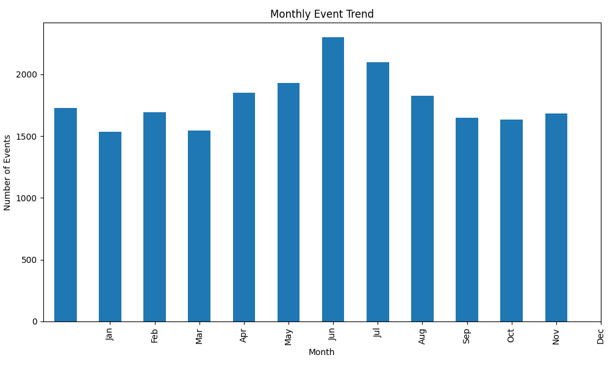
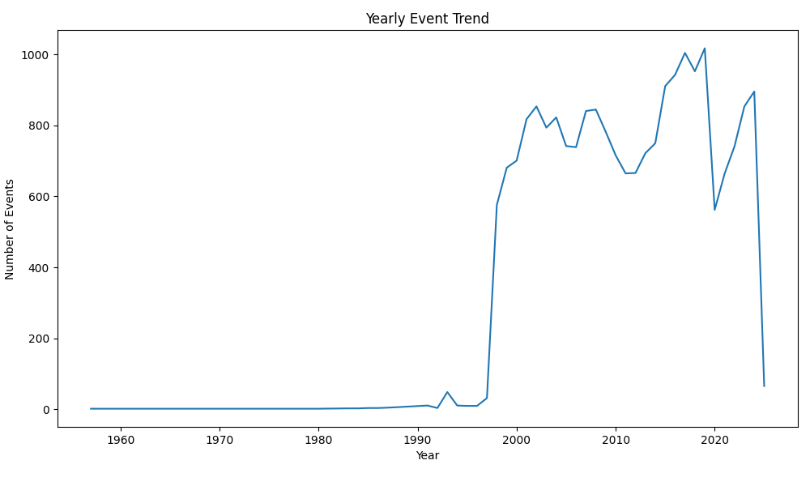
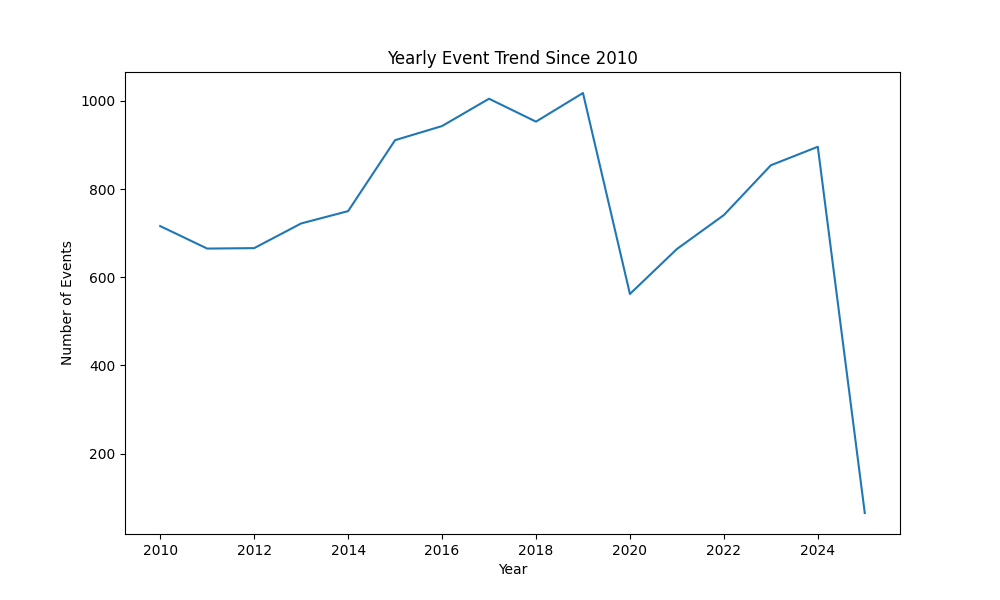
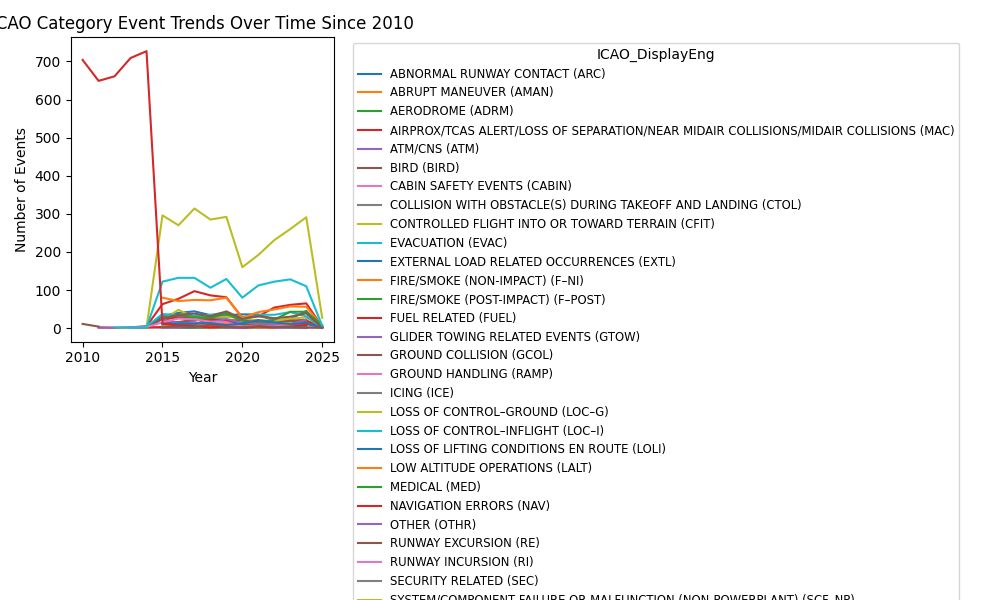
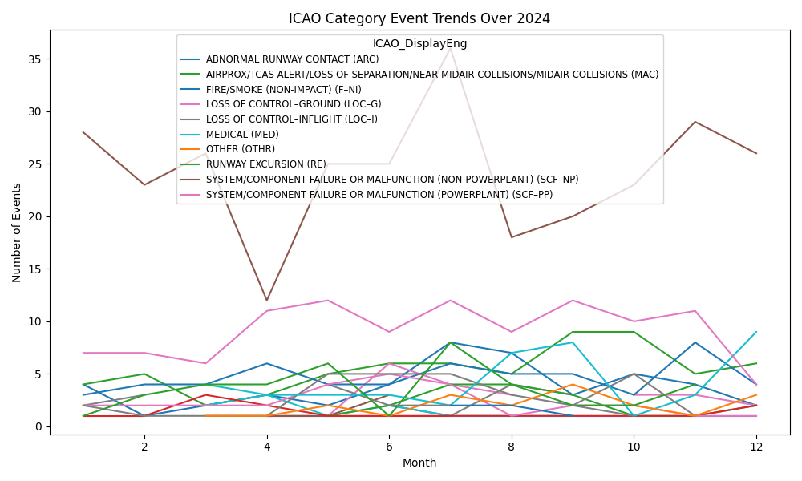

# Report

## 1. Completeness of Occurrence Table
### Prompt
Understanding data quality is essential in data science, and data quality encompasses a variety of dimensions.
Examine the Occurrence table and evaluate the completeness of the dataset. Use these findings to provide
recommendations about what types of analysis could be conducted with this data to better understand aviation accidents
and safety incidents as reported in the ASIS data.

### Response
The thoroughness of this examination would likely depend on the use case of the data (i.e. are we doing a quick check 
before an initial exploration of the data, am I doing an investigation to create a data cleaning plan before using 
the table in more expensive modeling workflows, or joining with other large datasets, etc.), but below are some initial 
checks I performed as a starting off point. 

#### 1. Null Values
It looks like about 70% of the dataset is empty (8,963,777 of 12,763,564 cells). A number of columns appear to be empty 
(or near empty) of datapoints. I wasn't sure if this was due to it being a public version of the data. As a quick sanity 
check, I validated the number of columns reported in this table equals the column count of the data (242 features).

_note: ranges are left-inclusive, right-exclusive_

| Ratio Null/Total | Column Count | Column Names                                                                                                                                                                                                                                                                                                                                                                                                                                                                                                                                                                                                                                                                                                                                                                                                                                                                                                                                                                                                                                                                                                                                                                                                                                                                                                                                                                                                                                                                                                                                                                                                                                                                                                                                                                                                                                                                                                                                                                                                                                                                                                                                                                                                                                                                                                                                                                                                                                                                                                                                                                                                                                                                                                                                                                                                                                                                                                                                                                                                                                                                                                                                                                                                                                                                                                                                                                        |                                                                                                                                                                                                                                                                                                                                                                                                                                                                                                                                                                                                                                                                                                                                                                                                                                                                                                                                                                                                                                                                                                                                                                                                                                                                                                                                                                                                                                                                                                                                                                                                                                                                                                                                                                                                                                                                                                                                                                                                                                                                                                                                                                                                                                                                                                                                                                                                                                                                                                                                                                                                                                                                                                                                                                                                                                                                                                                                                                                                                                                                                                                                                                                                                                                                                                                                                                
|------------------|--------------|-------------------------------------------------------------------------------------------------------------------------------------------------------------------------------------------------------------------------------------------------------------------------------------------------------------------------------------------------------------------------------------------------------------------------------------------------------------------------------------------------------------------------------------------------------------------------------------------------------------------------------------------------------------------------------------------------------------------------------------------------------------------------------------------------------------------------------------------------------------------------------------------------------------------------------------------------------------------------------------------------------------------------------------------------------------------------------------------------------------------------------------------------------------------------------------------------------------------------------------------------------------------------------------------------------------------------------------------------------------------------------------------------------------------------------------------------------------------------------------------------------------------------------------------------------------------------------------------------------------------------------------------------------------------------------------------------------------------------------------------------------------------------------------------------------------------------------------------------------------------------------------------------------------------------------------------------------------------------------------------------------------------------------------------------------------------------------------------------------------------------------------------------------------------------------------------------------------------------------------------------------------------------------------------------------------------------------------------------------------------------------------------------------------------------------------------------------------------------------------------------------------------------------------------------------------------------------------------------------------------------------------------------------------------------------------------------------------------------------------------------------------------------------------------------------------------------------------------------------------------------------------------------------------------------------------------------------------------------------------------------------------------------------------------------------------------------------------------------------------------------------------------------------------------------------------------------------------------------------------------------------------------------------------------------------------------------------------------------------------------------------------|
| 100%             | 9            | 'SafetyCommIssuedEnum_DisplayEng', 'SafetyCommIssuedEnum_DisplayFre', 'AirportDescription', 'InitialPositionEnum', 'InitialPositionEnum_DisplayEng', 'InitialPositionEnum_DisplayFre', 'FinalPositionEnum', 'FinalPositionEnum_DisplayEng', 'FinalPositionEnum_DisplayFre'                                                                                                                                                                                                                                                                                                                                                                                                                                                                                                                                                                                                                                                                                                                                                                                                                                                                                                                                                                                                                                                                                                                                                                                                                                                                                                                                                                                                                                                                                                                                                                                                                                                                                                                                                                                                                                                                                                                                                                                                                                                                                                                                                                                                                                                                                                                                                                                                                                                                                                                                                                                                                                                                                                                                                                                                                                                                                                                                                                                                                                                                                                          |
| 90-100%          | 128          | 'BearingID', 'BearingID_Abbr', 'BearingID_CompassPoint', 'BearingID_Highest', 'BearingID_Lowest', 'BearingID_Middle', 'Distance', 'DistanceEnum', 'DistanceEnumEng', 'DistanceEnumFre', 'OceanID', 'OceanID_DisplayEng', 'OceanID_DisplayFre', 'SkyCondID', 'SkyCondID_DisplayEng', 'SkyCondID_DisplayFre', 'InflightIcingCondEnum', 'InflightIcingCondEnum_DisplayEng', 'InflightIcingCondEnum_DisplayFre', 'GeneralWeatherID', 'GeneralWeatherID_DisplayEng', 'GeneralWeatherID_DisplayFre', 'Temperature', 'TemperatureEnum', 'TemperatureEnum_DisplayEng', 'TemperatureEnum_DisplayFre', 'SwDirection', 'SwVariableDirIND', 'SwVariableDirIND_DisplayEng', 'SwVariableDirIND_DisplayFre', 'SwSpeed', 'SwPeakGus', 'SwCrosswind', 'SwCrosswindEnum', 'SwCrosswindEnum_DisplayEng', 'SwCrosswindEnum_DisplayFre', 'SwTallWind', 'VisibilyCeiling', 'Visibility', 'RVRUnlimitedIND', 'RVRUnlimitedIND_DisplayEng', 'RVRUnlimitedIND_DisplayFre', 'RVRA', 'RVRB', 'WeatherPhenomenaTypeID', 'WeatherPhenomenaTypeID_DisplayEng', 'WeatherPhenomenaTypeID_DisplayFre', 'WeatherPhenomenaDescID', 'WeatherPhenomenaDescID_DisplayEng', 'WeatherPhenomenaDescID_DisplayFre', 'WeatherPhenomenaIntensityID', 'WeatherPhenomenaIntensityID_DisplayEng', 'WeatherPhenomenaIntensityID_DisplayFre', 'LandingTakeOffAirportID', 'LandingTakeOffAirportID_AirportName', 'AarfCategoryID', 'AarfCategoryID_DisplayEng', 'AarfCategoryID_DisplayFre', 'ControlStatusID', 'ControlStatusID_DisplayEng', 'ControlStatusID_DisplayFre', 'ApproachTypeID', 'ApproachTypeID_DisplayEng', 'ApproachTypeID_DisplayFre', 'ApproachRunwayID', 'ApproachRunwayID_DisplayEng', 'ApproachRunwayID_DisplayFre', 'RunwayID', 'RunwayID_DisplayEng', 'RunwayID_DisplayFre', 'TaxiwayID', 'TaxiwayID_DisplayEng', 'TaxiwayID_DisplayFre', 'PadID', 'PadID_DisplayEng', 'PadID_DisplayFre', 'HelicopterTakeOffLandingSiteID', 'HelicopterTakeOffLandingSiteID_DisplayEng', 'HelicopterTakeOffLandingSiteID_DisplayFre', 'RunwaySurfaceTypeID', 'RunwaySurfaceTypeID_DisplayEng', 'RunwaySurfaceTypeID_DisplayFre', 'RunwaySurfaceID', 'RunwaySurfaceID_DisplayEng', 'RunwaySurfaceID_DisplayFre', 'RunwaySlopeID', 'RunwaySlopeID_DisplayEng', 'RunwaySlopeID_DisplayFre', 'ResaSurfaceTypeID', 'ResaSurfaceTypeID_DisplayEng', 'ResaSurfaceTypeID_DisplayFre', 'WaveHeightID', 'WaveHeightID_DisplayEng', 'WaveHeightID_DisplayFre', 'WaterSurfaceConditionID', 'WaterSurfaceConditionID_DisplayEng', 'WaterSurfaceConditionID_DisplayFre', 'AreaTypeDetailID', 'AreaTypeDetailID_DisplayEng', 'AreaTypeDetailID_DisplayFre', 'ToLdgRelToSwellID', 'ToLdgRelToSwellID_DisplayEng', 'ToLdgRelToSwellID_DisplayFre', 'InitialPositionID', 'InitialPositionID_DisplayEng', 'InitialPositionID_DisplayFre', 'FinalPositionID', 'FinalPositionID_DisplayEng', 'FinalPositionID_DisplayFre', 'LandingTakeOffLocation', 'ResaLength', 'ResaWidth', 'TouchdownThreshold', 'TouchdownThresholdEnum', 'TouchdownThresholdEnum_DisplayEng', 'TouchdownThresholdEnum_DisplayFre', 'TouchdownCentreline', 'FinalThreshold', 'FinalThresholdEnum', 'FinalThresholdEnum_DisplayEng', 'FinalThresholdEnum_DisplayFre', 'FinalCentreline', 'FullProcedureIND', 'FullProcedureIND_DisplayEng', 'FullProcedureIND_DisplayFre', 'SurfaceContaminationID', 'SurfaceContaminationID_DisplayEng', 'SurfaceContaminationID_DisplayFre' |
| 80-90%           | 27           | 'LightCondID', 'LightCondID_DisplayEng', 'LightCondID_DisplayFre', 'SwDirectionEnum', 'SwDirectionEnum_DisplayEng', 'SwDirectionEnum_DisplayFre', 'TakeOffLandingTypeID', 'TakeOffLandingTypeID_DisplayEng', 'TakeOffLandingTypeID_DisplayFre', 'AerodromeOperatorID', 'AerodromeOperatorID_DisplayEng', 'AerodromeOperatorID_DisplayFre', 'ManeuverToFinalID', 'ManeuverToFinalID_DisplayEng', 'ManeuverToFinalID_DisplayFre', 'Elevation', 'OsLengthTotal', 'OsLengthAvailable', 'OsLengthUtilized', 'OsWidthTotal', 'OsWidthAvailable', 'TouchdownCentrelineEnum', 'TouchdownCentrelineEnum_DisplayEng', 'TouchdownCentrelineEnum_DisplayFre', 'FinalCentrelineEnum', 'FinalCentrelineEnum_DisplayEng', 'FinalCentrelineEnum_DisplayFre'                                                                                                                                                                                                                                                                                                                                                                                                                                                                                                                                                                                                                                                                                                                                                                                                                                                                                                                                                                                                                                                                                                                                                                                                                                                                                                                                                                                                                                                                                                                                                                                                                                                                                                                                                                                                                                                                                                                                                                                                                                                                                                                                                                                                                                                                                                                                                                                                                                                                                                                                                                                                                                         |
| 70-80%           | 4            | 'ICAOCategoryID', 'ICAO_DisplayEng', 'ICAO_DisplayFre', 'SafetyCommIssuedEnum'                                                                                                                                                                                                                                                                                                                                                                                                                                                                                                                                                                                                                                                                                                                                                                                                                                                                                                                                                                                                                                                                                                                                                                                                                                                                                                                                                                                                                                                                                                                                                                                                                                                                                                                                                                                                                                                                                                                                                                                                                                                                                                                                                                                                                                                                                                                                                                                                                                                                                                                                                                                                                                                                                                                                                                                                                                                                                                                                                                                                                                                                                                                                                                                                                                                                                                      |
| 60-70%           | 0            | _none_                                                                                                                                                                                                                                                                                                                                                                                                                                                                                                                                                                                                                                                                                                                                                                                                                                                                                                                                                                                                                                                                                                                                                                                                                                                                                                                                                                                                                                                                                                                                                                                                                                                                                                                                                                                                                                                                                                                                                                                                                                                                                                                                                                                                                                                                                                                                                                                                                                                                                                                                                                                                                                                                                                                                                                                                                                                                                                                                                                                                                                                                                                                                                                                                                                                                                                                                                                              |
| 50-60%           | 11           | 'AirportID', 'AirportID_AirportName', 'AirportID_CountryID', 'AirportID_CountryID_DisplayEng', 'AirportID_CountryID_DisplayFre', 'Airport_ProvinceID', 'AirportID_ProvinceID_DisplayEng', 'AirportID_ProvinceID_DisplayFre', 'Location', 'ICAO', 'CommonName'                                                                                                                                                                                                                                                                                                                                                                                                                                                                                                                                                                                                                                                                                                                                                                                                                                                                                                                                                                                                                                                                                                                                                                                                                                                                                                                                                                                                                                                                                                                                                                                                                                                                                                                                                                                                                                                                                                                                                                                                                                                                                                                                                                                                                                                                                                                                                                                                                                                                                                                                                                                                                                                                                                                                                                                                                                                                                                                                                                                                                                                                                                                       |
| 40-50%           | 6            | 'OccIncidentTypeID', 'OccIncidentTypeID_DisplayEng', 'OccIncidentTypeID_DisplayFre', 'SeriousIncidentEnum', 'SeriousIncidentEnum_DisplayEng', 'SeriousIncidentEnum_DisplayFre'                                                                                                                                                                                                                                                                                                                                                                                                                                                                                                                                                                                                                                                                                                                                                                                                                                                                                                                                                                                                                                                                                                                                                                                                                                                                                                                                                                                                                                                                                                                                                                                                                                                                                                                                                                                                                                                                                                                                                                                                                                                                                                                                                                                                                                                                                                                                                                                                                                                                                                                                                                                                                                                                                                                                                                                                                                                                                                                                                                                                                                                                                                                                                                                                      |
| 30-40%           | 0            | _none_                                                                                                                                                                                                                                                                                                                                                                                                                                                                                                                                                                                                                                                                                                                                                                                                                                                                                                                                                                                                                                                                                                                                                                                                                                                                                                                                                                                                                                                                                                                                                                                                                                                                                                                                                                                                                                                                                                                                                                                                                                                                                                                                                                                                                                                                                                                                                                                                                                                                                                                                                                                                                                                                                                                                                                                                                                                                                                                                                                                                                                                                                                                                                                                                                                                                                                                                                                              |
| 20-30%           | 6            | 'TsbInvolveID', 'TsbInvolveID_DisplayEng', 'TsbInvolveID_DisplayFre', 'TimeZoneID', 'TimeZoneID_DisplayEng', 'TimeZoneID_DisplayFre'                                                                                                                                                                                                                                                                                                                                                                                                                                                                                                                                                                                                                                                                                                                                                                                                                                                                                                                                                                                                                                                                                                                                                                                                                                                                                                                                                                                                                                                                                                                                                                                                                                                                                                                                                                                                                                                                                                                                                                                                                                                                                                                                                                                                                                                                                                                                                                                                                                                                                                                                                                                                                                                                                                                                                                                                                                                                                                                                                                                                                                                                                                                                                                                                                                                |
| 10-20%           | 1            | 'LocationDescription'                                                                                                                                                                                                                                                                                                                                                                                                                                                                                                                                                                                                                                                                                                                                                                                                                                                                                                                                                                                                                                                                                                                                                                                                                                                                                                                                                                                                                                                                                                                                                                                                                                                                                                                                                                                                                                                                                                                                                                                                                                                                                                                                                                                                                                                                                                                                                                                                                                                                                                                                                                                                                                                                                                                                                                                                                                                                                                                                                                                                                                                                                                                                                                                                                                                                                                                                                               |
| 0-10%            | 50           | 'OccID', 'OccNo', 'Latitude', 'LatEnum', 'LatEnum_DisplayEng', 'LatEnum_DisplayFre', 'Longitude', 'LongEnum', 'LongEnum_DisplayEng', 'LongEnum_DisplayFre', 'CountryID', 'CountryID_DisplayEng', 'CountryID_DisplayFre', 'OccClassID', 'OccClassID_DisplayEng', 'OccClassID_DisplayFre', 'OccDate', 'OccRegionID', 'OccRegionID_DisplayEng', 'OccRegionID_DisplayFre', 'OccTime', 'OccTypeID', 'OccTypeID_DisplayEng', 'OccTypeID_DisplayFre', 'PositionTypeEnum', 'PositionTypeEnum_DisplayEng', 'PositionTypeEnum_DisplayFre', 'ProvinceID', 'ProvinceID_DisplayEng', 'ProvinceID_DisplayFre', 'InitTSBNotifDate', 'ReportedByID', 'ReportedByID_DisplayEng', 'ReportedByID_DisplayFre', 'RespRegionID', 'RespRegionID_DisplayEng', 'RespRegionID_DisplayFre', 'Summary', 'TotalFatalCount', 'TotalMinorCount', 'TotalNoneCount', 'TotalSeriousCount', 'TotalUnknownCount', 'NoAircraftInvolved', 'InjuriesEnum', 'InjuriesEnum_DisplayEng', 'InjuriesEnum_DisplayFre', 'DeployedEnum', 'DeployedEnum_DisplayEng', 'DeployedEnum_DisplayFre'                                                                                                                                                                                                                                                                                                                                                                                                                                                                                                                                                                                                                                                                                                                                                                                                                                                                                                                                                                                                                                                                                                                                                                                                                                                                                                                                                                                                                                                                                                                                                                                                                                                                                                                                                                                                                                                                                                                                                                                                                                                                                                                                                                                                                                                                                                                                      |

I also pulled some information for columns that have lower null value rates. Given this is a relatively small dataset 
with 52,742 rows, these columns would be contributing a greater weight of information during an analysis.

#### Record Dates 
Another method I like to use to see the completeness of data is to review the frequency of new records (e.g. the count 
of new records each day/month/year, depending on the reporting cycle). This usually shows a change in the
frequency of events, but I also use it as a sanity check for data source and ingestion errors. I have found cases where
historical source data accidentally included records dated in the future, or ommitted dates in error.

| Column                | Description                                                                                 | 
|-----------------------|---------------------------------------------------------------------------------------------|
| OccID                 | System-generated occurrence identification number (e.g. 159500).                            |
| OccNo                 | Unique occurrence number for a record (e.g. A22O0022).                                      |
| OccDate               | The occurrence date in the format YYYY-MM-DD.                                               |
| OccTime               | The time the occurrence happened in the format hh:mm (24-hour clock).                       |
| InitTSBNotifDate      | Initial TSB notification date (agency that initially reported the occurrence) in datetime2. |
| TimeZoneID            | System-generated time zone id (e.g. 1)                                                      |
| TimeZoneID_DisplayEng | The time zone used for reporting the time of occurrence, in English.                        | 

I assume the time zone column represents the time zone in which the occurrence happened.
It was not clear skimming the data dictionary whether the `OccDate` and `InitTSBNotifDate` values were corrected to UTC 
or not. I didn't do any modifications here, but it could affect the accuracy of this report inflating/under-counting 
dates and times bordering cutoffs.

On a year-to-year basis, the record frequency seems to make sense. It would be worth overlaying flight frequency to 
see if the peaks and valleys are consistent. I was surprised to not see a bigger dip in the years immediately following 
2001, but the dip around covid makes sense.

On a month-to-month basis, I didn't expect to see so few reports for February since I pulled the dataset in March. I'm
guessing this is due to lengthy reporting cycles, and would use caution analyzing records that include February 2025 
(especially those which aggregate values).

#### Summary Statistics
I would like to spend more time exploring the data, especially the following columns: 'AirportID_CountryID', 'ICAO', 
'CountryID', 'Distance', 'ICAOCategoryID', 'OccClassID', 'OccDate', 'OccIncidentTypeID', 'OccRegionID', 'OccTime', 
'OccTypeID', 'SeriousIncidentEnum', 'Summary', 'TotalFatalCount', 'TotalMinorCount', 'TotalNoneCount', 
'TotalSeriousCount', 'TotalUnknownCount'.

I pulled some [general summary statistics](outputs/q1_completeness/data_summary.csv) for this subset of the dataset, 
but ideally I'd employ more user-friendly visualization and summary libraries to look for relationships in the data, 
their structure/values, patterns and trends.

### Next Steps
Libraries such as [ydata-profiling](https://docs.profiling.ydata.ai/latest/) would be nice to use here to quickly build 
some summary and visual information about the dataset. The cardinality of the data is high. Having more information 
about the expected use case, or speaking with a subject matter expert about which features are more critical or 
error-prone/finicky than others, would be fruitful in limiting the amount of time I spend digging into less relevant 
dimensions of the data.

I had to do a bit of manipulation on the data types while reading in the source csv. I used the source
ASIS data dictionary to coerce the expected data types onto the read, supplemented with [this documentation](https://learn.microsoft.com/en-us/sql/t-sql/data-types/datetime2-transact-sql?view=sql-server-ver16) 
on parsed date formats. For some columns, especially the date and time columns, I would have spent more time making sure 
the values were parsed correctly. For important categorical features, I would have also spent more time validating the 
range of categories (e.g. that "unknown" and "UNKNOWN" are cleaned so they are not considered as separate categories of 
a feature value). 

I would like to explore the subgroups in different ICAO categories to better understand the representation of 
events and rates of different values. It would be interesting to perform a more thorough EDA (as discussed above) to look
at event counts, types, locations, times, and outcomes. 
To get a better sense of the rate of events in general, it could be useful to pull in another dataset on general flight 
frequency and maybe maintenance logs.

## 5. ICAO Event Categories
### Prompt
What ICAO event categories are most common at Canadian airports? Is there any trend or pattern evident in these
Canadian events?

### Data Peek
The Occurrences table is definitely relevant here. It may also be useful to pull the Aircraft and Events and Phases 
tables, but for the sake of time I'll start with Occurrences.

Skim data dictionary for relevant columns to explore...

| Column Name                     | Data Type        | Description                                                                                                                                                           |
|---------------------------------|------------------|-----------------------------------------------------------------------------------------------------------------------------------------------------------------------|
| AirportID_CountryID_DisplayEng  | varchar (object) | Airport country (English).                                                                                                                                            |
| AirportID_CountryID             | int              | Category label for a particular airport country.                                                                                                                      |
| Airport_ProvinceID              | int              | Category label for a particular airport province.                                                                                                                     |
| AirportID_ProvinceID_DisplayEng | varchar (object) | Airport province (English).                                                                                                                                           |
| AirportID_AirportName           | varchar (object) | Airport identification number airport name. Name of occurrence airport, or airport used as reference to the occurrence location.                                      |
| AirportID                       | int              | Airport identification number                                                                                                                                         |
| LandingTakeOffLocation          | varchar (object) | The International Civil Aviation Organization (ICAO) airport/aerodrome abreviations identifying the geographic location for the occurrence landing/takeoff.           |
| LocationDescription             | varchar (object) | The location of the occurrence _if not at the airport_.                                                                                                               |
| Location                        | varchar (object) | The location of the occurrence.                                                                                                                                       |
| ICAOCategoryID                  | int              | Category label for ICAO category.                                                                                                                                     |
| ICAO_DisplayEng                 | varchar (object) | ICAO occurrence category, in English. _For one occurrence, multiple ICAO categories may be assigned, that will generate multiple entries/rows_.                       |
| OccID                           | int              | Occurrence ID number.                                                                                                                                                 |
| OccNo                           | varchar (object) | Occurrence number (unique occurrence number for general reference).                                                                                                   |                                                                                                                                                                       |
| OccDate                         | date             | The occurrence date in the format YYYY-MM-DD.                                                                                                                         |
| OccTime                         | time             | The time the occurrence happenedin the format hh:mm (24-hour clock).                                                                                                  |
| OccIncidentTypeID               | int              | Category label for OccIncidentType category.                                                                                                                          |
| OccIncidentTypeID_DisplayEng    | varchar (object) | If the occurrence is a reportable incident, the type of incident as defined in the Transportation Safety Board Regulations, Part 1, Subparagraph 2(1)(b), in English. |

_notes from data dictionary review_: 
- Make sure I'm reviewing only events at a Canadian airport.
- Multiple ICAO categories can be assigned to a particular event - make sure I group rows/events correctly. Review how ID columns work!
- _Transportation Safety Board Regulations, Part 1, Subparagraph 2(1)(b)_ may be a relevant external document.
- Checkout weather.
- Checkout aircraft make/model. 
- Checkout specific airports.
- Checkout specific time of year.
- Checkout specific time of day.
- Checkout specific time of week.

### Mini Exploration

There appears to be 36 unique ICAO categories matching a Canadian AirportID. There are 12,752 rows with null values.
I'd need to look at a sample of those rows to get an idea of how to deal with them (i.e. remove them, or stick them 
under another category), but for now I'll just assign an ID of 36 and value of "UNKNOWN OR UNDETERMINED (UNK)" since it 
already exists.

| ICAOCategoryID | ICAO_DisplayEng                                                                      | 
|----------------|--------------------------------------------------------------------------------------|
| 1              | ABNORMAL RUNWAY CONTACT (ARC)                                                        |
| 2              | ABRUPT MANEUVER (AMAN)                                                               |
| 3              | AERODROME (ADRM)                                                                     |
| 4              | AIRPROX/TCAS ALERT/LOSS OF SEPARATION/NEAR MIDAIR COLLISIONS/MIDAIR COLLISIONS (MAC) |
| 5              | ATM/CNS (ATM)                                                                        |
| 6              | BIRD (BIRD)                                                                          |
| 7              | CABIN SAFETY EVENTS (CABIN)                                                          |
| 8              | COLLISION WITH OBSTACLE(S) DURING TAKEOFF AND LANDING (CTOL)                         |
| 9              | CONTROLLED FLIGHT INTO OR TOWARD TERRAIN (CFIT)                                      |
| 10             | EVACUATION (EVAC)                                                                    |
| 11             | EXTERNAL LOAD RELATED OCCURRENCES (EXTL)                                             |
| 12             | FIRE/SMOKE (NON-IMPACT) (F–NI)                                                       |
| 13             | FIRE/SMOKE (POST-IMPACT) (F–POST)                                                    |
| 14             | FUEL RELATED (FUEL)                                                                  |
| 15             | GLIDER TOWING RELATED EVENTS (GTOW)                                                  |
| 16             | GROUND COLLISION (GCOL)                                                              |
| 17             | GROUND HANDLING (RAMP)                                                               |
| 18             | ICING (ICE)                                                                          |
| 19             | LOSS OF CONTROL–GROUND (LOC–G)                                                       |
| 20             | LOSS OF CONTROL–INFLIGHT (LOC–I)                                                     |
| 21             | LOSS OF LIFTING CONDITIONS EN ROUTE (LOLI)                                           |
| 22             | LOW ALTITUDE OPERATIONS (LALT)                                                       |
| 23             | MEDICAL (MED)                                                                        | 
| 24             | NAVIGATION ERRORS (NAV)                                                              |
| 25             | RUNWAY EXCURSION (RE)                                                                |
| 26             | RUNWAY INCURSION (RI)                                                                | 
| 27             | SECURITY RELATED (SEC)                                                               |
| 28             | SYSTEM/COMPONENT FAILURE OR MALFUNCTION (NON-POWERPLANT) (SCF–NP)                    |
| 29             | SYSTEM/COMPONENT FAILURE OR MALFUNCTION (POWERPLANT) (SCF–PP)                        | 
| 30             | TURBULENCE ENCOUNTER (TURB)                                                          | 
| 31             | UNDERSHOOT/OVERSHOOT (USOS)                                                          |
| 32             | UNINTENDED FLIGHT IN IMC (UIMC)                                                      |
| 33             | WILDLIFE (WILD)                                                                      |
| 34             | WIND SHEAR OR THUNDERSTORM (WSTRW)                                                   |
| 35             | OTHER (OTHR)                                                                         |
| 36             | UNKNOWN OR UNDETERMINED (UNK)                                                        | 

There appears to be 18 unique occurrence incident types matching a Canadian AirportID. I'll assign an ID of 19 and 
value of "UNKNOWN" to rows with null values for now.

| 'OccIncidentTypeID' | 'OccIncidentTypeID_DisplayEng'      |
|---------------------|-------------------------------------|
| 1                   | ENGINE (i)                          | 
| 2                   | SMOKE OR FIRE (iii)                 |
| 3                   | DIFFICULT TO CONTROL (iv)           |
| 4                   | RUNWAY EXCURSION (v)                |
| 5                   | UNABLE TO PERFORM (vi)              |
| 6                   | DEPRESSURIZATION (vii)              | 
| 7                   | FUEL SHORTAGE (viii)                |
| 8                   | INCORRECT / CONTAMINATED FUEL(ix)   |
| 9                   | J. ROC / LOS                        |
| 10                  | SLUNG LOAD RELEASED (xii)           | 
| 11                  | EMERGENCY/PRIORITY (xi)             |
| 12                  | DANGEROUS GOODS RELEASED (xii)      |
| 13                  | TRANSMISSION GEARBOX (ii)           |
| 14                  | COLLISION (x)                       | 
| 15                  | RISK OF COLLISION (x)               |
| 16                  | LOSS OF SEPARATION (x)              |
| 17                  | LANDING GEAR RETRACTED/COLLAPSED(v) |
| 18                  | DRAGS ANY PART ON GROUND (v)        | 
| 19                  | UNKNOWN                             |

After seeing that multiple ICAO categories may be assigned to a particular event, I tried to pull information on how
this data is reflected or captured. Note these values were pulled on the Canadian airport subset:
- Total row count: 21,469
- Count of unique combinations of OccID and ICAOCategoryID: 21,220
- Count of unique combinations of OccDate and OccNo: 20,285
- Count of unique combinations of OccDate and OccID: 20,285
- Count of unique OccID values: 20,285
- Count of unique OccNo values: 20,285

From what I can tell, there are 935 rows that may represent occurrences with multiple ICAO categories assigned (or I am 
otherwise not considering correctly). In any case, there are 249 rows that I am not sure how to account for. 
I'm not totally sure what combination of column values are used to isolate a unique occurrence 
event from others where multiple categories apply, but it's a small enough percentage that for now I will move on.

I wasn't sure how to ensure that I'm only reporting events that occurred specifically at an airport. I considered 
removing rows containing a value in the 'LocationDescription' column, but wasn't super confident doing so without
spening more time understanding the dataset. For now I'll do some analyses as-is. 

July appears to have occurrences more frequently than other months (note this graph is an aggregate of all years).

I'm not sure if there were actually less incidents before the 90s because flying was less common, or if that reflects 
improvements in the gathering and reporting of data. Incidents seemed to drop during the recession and covid.

Again, this data needs to be broken down further, but it appears there was a big shift in the most common ICAO 
categories between 2010 - 2020. This could be a change in how events are classified into categories, or some shift in 
procedure or safety standard maybe?

### Trends
This is by no means a conclusive analysis, but I've spent the allotted time and will show what I've gathered so far. 
I filtered the data to only explore years after 2009.

The color selection of the legend makes it a little hard to see, but it looks like the shift I described above might be
due to differences in how events were classified into ICAO categories. It looks like the category "NAVIGATION ERRORS" 
may have been broken down into subcategories (e.g. CFIT, LOC-I, etc.), which is why the frequency of those events 
flipped at what looks to be a point in time. This is just a hunch though.

I attempted to filer the legend values to only display the more common datapoints. If I did that correctly, it 
appears the most common ICAO category last year was "SYSTEM/COMPONENT FAILURE OR MALFUNCTION (NON-POWERPLAN) (SCF-NP)."

### Next Steps
Next steps would be to look a little more closely at a sample to ensure I'm filtering the data correctly. 

In terms of digging deeper into trends, it'd be worthwhile to look at the most common categories year over year, to 
get a sense of which ones have changed the most, or been overcome by others. Then, after isolating those categories 
which have shifted in frequency, I would look at things like weather and seasonal patterns, time of day, week and month, 
and maybe break the data down into specific airports and aircraft models depending on how things look as I go. 

